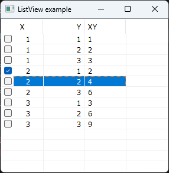
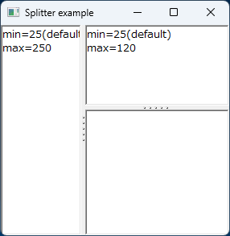
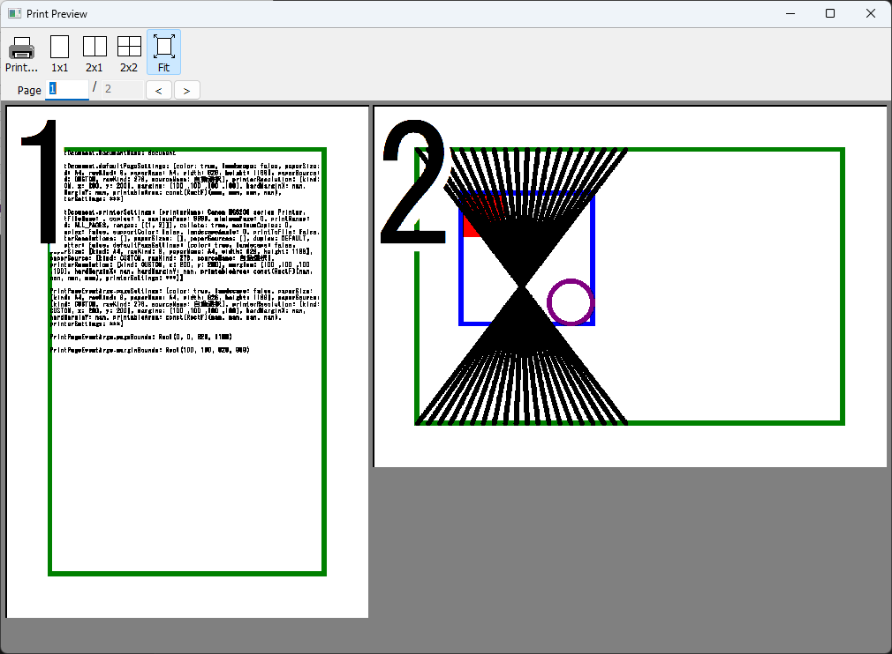
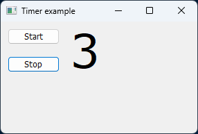
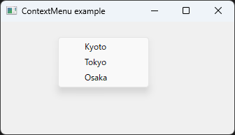

# DFL

This unofficial project is a migration of [D Forms Library (DFL)](http://wiki.dprogramming.com/Dfl/HomePage "D Forms Library (DFL)") that is managed on SVN.
DFL is a Win32 windowing library for the D language.

```d
import dfl;

void main()
{
	Form form = new Form;
	form.text = "Welcome to DFL";
	form.size = Size(300, 300);

	Button button = new Button;
	button.text = "OK";
	button.location = Point(20, 20);
	button.size = Size(100, 50);
	button.click ~= (Control c, EventArgs e) => msgBox("OK button is clicked.");
	button.parent = form;

	Application.run(form);
}
```


## Recent major features
- **Module "dfl.toastnotifier" is now comming.**
	- ToastNotifier (with example)
	- ToastNotifierLegacy (with example)
- Removed dependency on undeaD library.
- Windows OMF support has been removed (for DMD v2.109.0).
- Registered DFL to DUB.
- Supported multiple screens.
- Module "dfl.chart" is now comming.
	- TableRenderer (with example)
	- LineGraphRenderer (with example)
	- TimeChartRenderer (with example)
- Module "dfl.printing" is now comming.
	- PrintDialog
	- PrintSetupDialog
	- PrintPreviewDialog
- Remove dflexe.
- Remove GTK-based DFL.
- Remove some bundled libraries such as user32_dfl.lib etc... (From now on, use dmd-bundled libraries such as the MinGW platform library and so on.)

## Screen shots














## Usage
First, you make new DUB project:
```bat
> cd examples\new_project
> dub init
```
Add DFL to local DUB registry:
```bat
> dub add dfl
> dub list
Packages present in the system and known to dub:
  dfl 0.10.11: c:\your\path\dfl\0.10.11\dfl\
  silly 1.2.0-dev.2: c:\your\path\silly\1.2.0-dev.2\silly\
```
Build and run your GUI applications with DUB as below:
```bat
> dub build -a=x86_64
> dub run
```
**IMPORTANT**: DUB is building **dfl_dub.lib** that is **not** containing WINSDK libraries.

## APPENDIX: Build and Install dfl.lib and dfl_debug.lib
### 1. Set environment variables
Fix the paths below:
```bat
set dmd_path=c:\d\dmd2\windows
set dmc_path=c:\dmc\dm
```

### 2. Make dfl.lib and dfl_debug.lib
Run **makelib.bat** (MSVC required):
```bat
> cd dfl
> makelib.bat           # 32-bit mscoff
```
or (MSVC required)
```bat
> makelib.bat 32mscoff  # ditto
```
or (MSVC required)
```bat
> makelib.bat 64        # 64-bit mscoff
```
Also copy **dfl.lib** and **dfl_debug.lib** in `dfl/source` to `your/lib/dir`.

**IMPORTANT**: These library files are containing WINSDK libraries such as **user32.lib**, **gdi32.lib** and so on.

In order to make and move *.lib to paths below:
- **go.bat** (MSVC required) : Make and move *.lib to `%dmd_path%\lib32mscoff`
- **go.bat 32mscoff** (MSVC required) : ditto
- **go64.bat** (MSVC required) : Make and move *.lib to `%dmd_path%\lib64`

## License
DFL is under the boost and/or zlib/libpng license.

However, trackbar.d is covered by the MIT license.
