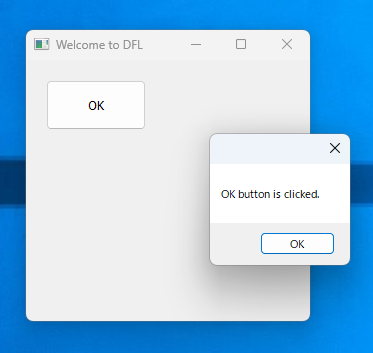
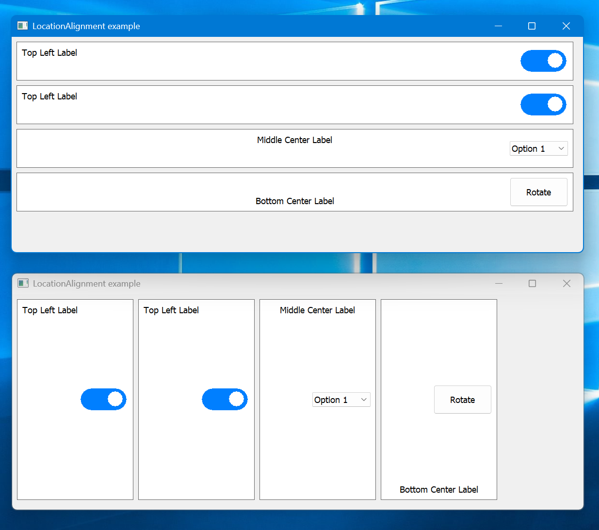
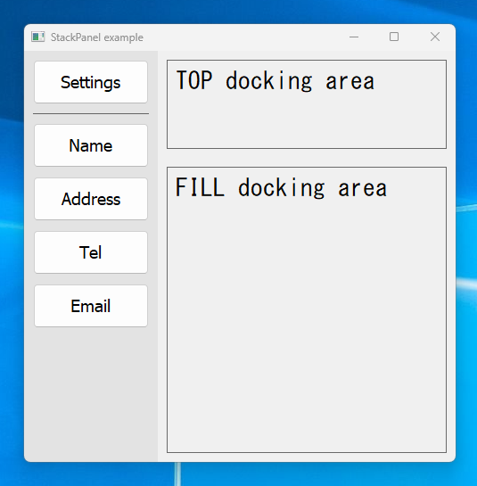
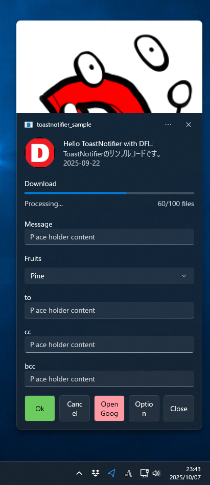
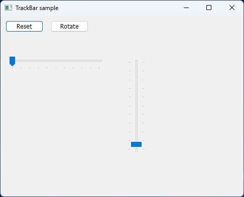
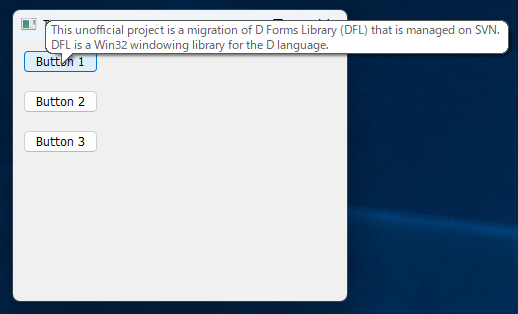
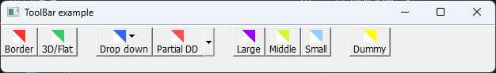
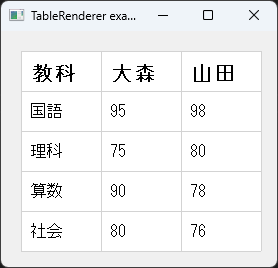
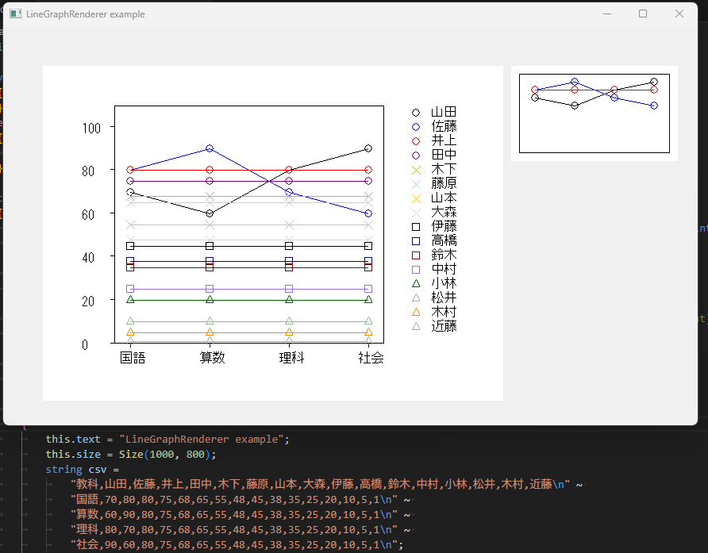
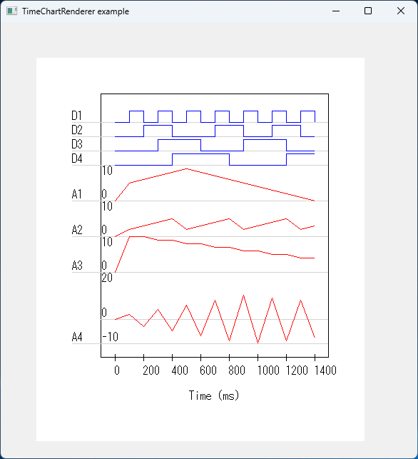

# DFL

[DFL (D Forms Library)](http://wiki.dprogramming.com/Dfl/HomePage "DFL (D Forms Library)") is a Win32 GUI library for the D language.

```d
import dfl;

void main()
{
	Application.enableVisualStyles();
	Application.setHighDpiMode(HighDpiMode.PER_MONITOR_V2);
	
	Form form = new Form;
	form.text = "Welcome to DFL";
	form.size = Size(300, 300);

	Button button = new Button;
	button.text = "OK";
	button.location = Point(20, 20);
	button.size = Size(100, 50);
	button.click ~= (Control c, EventArgs e) => msgBox("OK button is clicked.");
	button.parent = form;

	Application.run(form);
}
```


## Recent major features
- **dfl.folderdialog has changed from a legacy dialog based on SHBrowseForFolder (left image) 
to a modern dialog based on IFileDialog (right image).**


- Supports dpi-aware (per monitor v2).
	- Add Application.setHighDpiMode method.
		- ```DPI_UNAWARE```
		- ```SYSTEM_AWARE```
		- ```PER_MONITOR```
		- ```PER_MONITOR_V2```
		- ```DPI_UNAWARE_GDI_SCALED```
	- Add Control.onDpiChanged method for recursive dpi-change.

- Add LocationAlignment property to Control class for easily layout customize GUI elements (with example code) .
	- While WinForms' Anchor maintains a constant distance to the edge of the parent control, LocationAlignment sets the distance to the edge of the parent control to zero.
	- LocationAlignment is affected by the dockMargin property.
	- LocationAlignment and DockStyle cannot be used at the same time.



- Enabled padding and margin configuration for all Control types.
- StackPanel class and example code are now comming.



- Reworked build-scripts (makelib.bat, makecoff.bat and go.bat) to better work with DUB and MSVC 2022.
	- dfl.lib and dfl_debug.lib are created in \dfl\bin, just like DUB.
- Module "dfl.toggleswitch" and example code are now comming.


- Module "dfl.toastnotifier" is now comming (with example).
	- ToastNotifier
	- ToastNotifierLegacy



- Registered DFL to DUB.
- Module "dfl.chart" is now comming (with example).
	- TableRenderer
	- LineGraphRenderer
	- TimeChartRenderer
- Module "dfl.printing" is now comming (with example).
	- PrintDialog
	- PrintSetupDialog
	- PrintPreviewDialog
- Remove some bundled libraries such as user32_dfl.lib etc... (From now on, use dmd-bundled libraries such as the MinGW platform library and so on.)

## Screen shots















## Usage
First, you make new DUB project:
```bat
> cd examples\new_project
> dub init
```
Add DFL to local DUB registry:
```bat
> dub add dfl
> dub list
Packages present in the system and known to dub:
  dfl 0.11.3: c:\your\path\dfl\0.11.3\dfl\
  silly 1.2.0-dev.2: c:\your\path\silly\1.2.0-dev.2\silly\
```
Build and run your GUI applications with DUB as below:
```bat
> dub build -a=x86_64
> dub run
```
**IMPORTANT**: DUB is building **dfl_dub.lib** that is **not** containing WINSDK libraries.

## APPENDIX I: Build and Install dfl.lib and dfl_debug.lib

### 1. Install Visual Studio 2022 Community Edition
Free downloads MSVC build tools from [https://visualstudio.microsoft.com/vs/community/](https://visualstudio.microsoft.com/vs/community/).


### 2. Set environment variables
Fix the paths below:
```bat
set dmd_path=c:\d\dmd2\windows
```

### 3. Open the MSVC build tools command prompt
Open **x64 Native Tools Command Prompt for VS 2022** from start menu.


### 4. Make dfl.lib and dfl_debug.lib
Run **makelib.bat** (MSVC required):
```bat
> cd dfl

> dir *.bat /B
go.bat
makecoff.bat
makelib.bat
_cmd.bat

> makelib.bat           # 32-bit mscoff
```
or (MSVC required)
```bat
> makelib.bat 32mscoff  # ditto
```
or (MSVC required)
```bat
> makelib.bat 64        # 64-bit mscoff
```
Also copy **dfl.lib** and **dfl_debug.lib** in `\dfl\bin` to `\your\lib\dir`.

**IMPORTANT**: These library files are containing WINSDK libraries such as **user32.lib**, **gdi32.lib** and so on.

In order to make and move *.lib to paths below:
- **go.bat** (MSVC required) : Make and move *.lib to `%dmd_path%\lib32mscoff`
- **go.bat 32mscoff** (MSVC required) : ditto
- **go64.bat** (MSVC required) : Make and move *.lib to `%dmd_path%\lib64`

## APPENDIX II: DFL With WinRT

1. If you use dfl.internal.winrt, install **Visual Studio 2022** and Windows 10 SDK (10.0.19041.0) or newer.
1. You must link **WindowsApp.lib** contained the SDK to your application.

## License
DFL is under the boost and/or zlib/libpng license.
