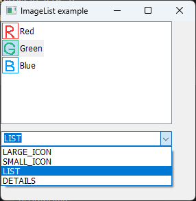
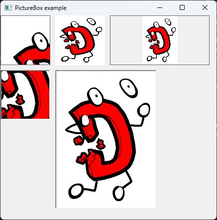
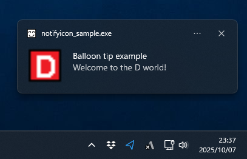

# DFL

This unofficial project is a migration of [D Forms Library (DFL)](http://wiki.dprogramming.com/Dfl/HomePage "D Forms Library (DFL)") that is managed on SVN.
DFL is a Win32 windowing library for the D language.

## Recent major features
- **Module "dfl.chart" is now comming.**
  - TableRenderer (with example)
  - **LineGraphRenderer (with example)**
  - ~TimeChartRenderer~
- Add simple clock "Dclock" as an example of DFL application.
- Module "dfl.printing" is now comming.
  - PrintDialog
  - PrintSetupDialog
  - PrintPreviewDialog
- DUB is available for DFL.
- Remove dflexe.
- Remove GTK-based DFL.
- Remove some bundled libraries such as user32_dfl.lib etc... (From now on, use dmd-bundled libraries such as the MinGW platform library and so on.)

## Screen shots









## Build and Install (dfl.lib and dfl_debug.lib)
### 1. Set environment variables
Fix the paths below:
```bat
set dmd_path=c:\d\dmd2\windows
set dmc_path=c:\dmc\dm
```
### 2. Install the undeaD library
DFL is required the undeaD library (**undead.lib**).
Download a ZIP file from https://github.com/dlang/undead.
Extract **undeaD-master.zip** and run the below with either option -a=x86_omf, x86_32mscoff or x86_64:
```bat
> cd undeaD-master
> dub build -a=x86_omf
    Starting Performing "debug" build using C:\D\dmd2\windows\bin\dmd.exe for x86, x86_omf.
  Up-to-date undead ~master: target for configuration [library] is up to date.
> dir bin /b
undead.lib
```
Copy the **undead.lib** to your/lib/dir.

### 3. Make dfl.lib and dfl_debug.lib
Run **makelib.bat**:
```bat
> cd dfl/win32/dfl
> makelib.bat 32omf     # 32-bit omf
```
or (MSVC required)
```bat
> makelib.bat           # 32-bit mscoff
```
or (MSVC required)
```bat
> makelib.bat 32mscoff  # ditto
```
or (MSVC required)
```bat
> makelib.bat 64        # 64-bit mscoff
```
Also copy **dfl.lib** and **dfl_debug.lib** to your/lib/dir.

**IMPORTANT**: Both library files are containing the **undead.lib** and WINSDK libraries such as **user32.lib**, **gdi32.lib** and so on.

In order to make and move *.lib to paths below:
- **go32omf.bat** : Make and move *.lib to %dmd_path%\lib
- **go.bat** (MSVC required) : Make and move *.lib to %dmd_path%\lib32mscoff
- **go.bat 32mscoff** (MSVC required) : ditto
- **go64.bat** (MSVC required) : Make and move *.lib to %dmd_path%\lib64

## With DUB **(RECOMMENDED)**
First, add DFL to local DUB registry:
```bat
> cd dfl
> dub add-local .
> dub list
Packages present in the system and known to dub:
  dfl ~master: c:\your\path\dfl\
```
Build and run your GUI applications with DUB as below:
```bat
> cd examples\hello_dfl
> dub build -a=x86_omf
> dub run
```
See also **./examples/hello_dfl/dub.json**.

**IMPORTANT**: DUB is building **dfl_dub.lib** that is **not** containing **undead.lib** and WINSDK libraries.

## License
DFL is under the boost and/or zlib/libpng license.

However, trackbar.d is covered by the MIT license.
